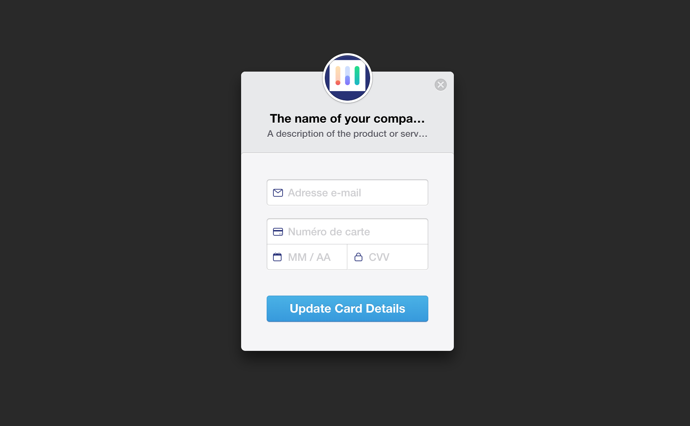

# stripe-update-card


[](https://travis-ci.org/FGRibreau/stripe-update-card) [](https://codecov.io/gh/FGRibreau/stripe-update-card)
[](https://crates.io/crates/stripe-update-card) [](https://crates.io/crates/stripe-update-card) [](https://crates.io/crates/stripe-update-card)

<p align="center">
    
</p>

Expose a static page that let a customer update its credit card information on Stripe.

Features:
- entirely customizable
- delete `customer_id`current card and replace it with the new one


## ⛴ Setup

```bash
cargo install stripe-update-card
```

## Configuration

Configuration is managed through environment variables, see [.env.dist](./.env.dist) for the full-list.

## 🤓 Self-documentation

Launch it, and enjoy!

```bash
# load configurations (environment variables)
source .env
# start server
stripe-update-card &
# open payment update cardwebpage
open http://localhost:8080/{customer_id}
```


## ⚙️ Deployment 
- Deploy it (the fastest way is to use [Clever-cloud](https://www.clever-cloud.com/doc/rust/rust/) thanks to their awesome native Rust support)
- Done!

> ## ❤️ Shameless plug
> - [**Charts, simple as a URL**. No more server-side rendering pain, 1 url = 1 chart](https://image-charts.com)
> - [Looking for a free **Redis GUI**?](http://redsmin.com) [Or for **real-time alerting** & monitoring for Redis?](http://redsmin.com)

## 🦄 You love it? Donate :)

<span class="badge-patreon"><a href="https://patreon.com/fgribreau" title="Donate to this project using Patreon"></a></span>
<span class="badge-gratipay"><a href="https://www.gratipay.com/fgribreau" title="Donate weekly to this project using Gratipay"></a></span>
<span class="badge-flattr"><a href="https://flattr.com/profile/fgribreau" title="Donate to this project using Flattr"></a></span>
<span class="badge-paypal"><a href="https://fgribreau.me/paypal" title="Donate to this project using Paypal"></a></span>
<span class="badge-bitcoin"><a href="https://www.coinbase.com/fgribreau" title="Donate once-off to this project using Bitcoin"></a></span>

## Development


```
cargo install cargo-watch
cargo install cargo-release

source .env

# watch for changes and restart everytime
RUST_LOG=debug cargo watch -x run 
```


## CI

This project use Travis-CI to run tests & do builds.

Required environment variables are:

- CODECOV_TOKEN (get one at https://codecov.io/gh/FGRibreau/ )