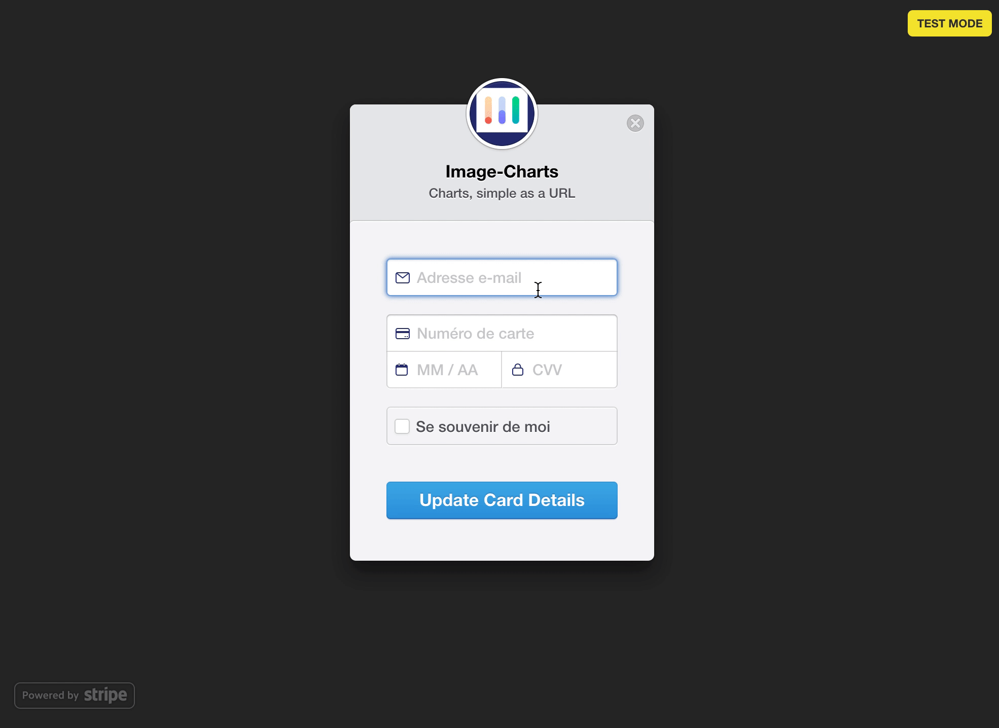

# Stripe Update Card microservice

Expose a page that let your customers update their payment information on Stripe.

[](https://travis-ci.org/FGRibreau/stripe-update-card)
[](https://crates.io/crates/stripe-update-card) [](https://crates.io/crates/stripe-update-card) [](https://crates.io/crates/stripe-update-card) [](https://hub.docker.com/r/fgribreau/stripe-update-card/) [](https://hub.docker.com/r/fgribreau/stripe-update-card/)

<!-- [](https://codecov.io/gh/FGRibreau/stripe-update-card) -->

<p align="center">
    
</p>


### 🐳 Getting started

```bash
docker run -it \
 -e STRIPE_PUBLISHABLE_KEY=pk_test_xxx \
 -e STRIPE_SECRET_KEY=sk_test_xxx \
 -e SUCCESS_REDIRECT_URL=https://url.to.redirect/on/success \
 -p 8080:8080 \
 fgribreau/stripe-update-card

# open payment update page for customer id: cus_D1Cj3rjHrjPQg5
open http://localhost:8080/cus_XXXXXXXXXXXX
```

Don't forget to change `cus_XXXXXXXXXXXX` with the Stripe customer id and then expose the URL `http://sub.domain.tld/cus_XXXXXXXXXXXX` from your app.

## Configuration

Configuration is managed through environment variables, see [.env.dist](./.env.dist) for the full-list.


```bash
# mandatory config
STRIPE_PUBLISHABLE_KEY=pk_test_xxxxxxxx
STRIPE_SECRET_KEY=sk_test_xxxx
SUCCESS_REDIRECT_URL=https://url.to.redirect/on/success

# optional config
PAGE_TITLE="Update Card"
FORM_DATA_IMAGE=/path/to/your/logo.png
FORM_DATA_NAME="The name of your company or website"
FORM_DATA_DESCRIPTION="A description of the product or service being purchased"
FORM_DATA_PANEL_LABEL="Update Card Details"
FORM_DATA_COLLECT_BILLING_ADDRESS=false
FORM_DATA_LABEL="Update Card Details"
FORM_DATA_ALLOW_REMEMBER_ME=false
FORM_DATA_LOCALE=auto
```

See [stripe-update-card](https://hub.docker.com/r/fgribreau/stripe-update-card/) on docker hub.

## Running in production at

- [Image-Charts](https://payment.image-charts.com/cus_XXXXXX)
- [Redsmin](https://payment.redsmin.com/cus_XXXXXX)

## 🦄 Do you use it in production? Please support my work :)

<span class="badge-patreon"><a href="https://patreon.com/fgribreau" title="Donate to this project using Patreon"></a></span>
<span class="badge-gratipay"><a href="https://www.gratipay.com/fgribreau" title="Donate weekly to this project using Gratipay"></a></span>
<span class="badge-flattr"><a href="https://flattr.com/profile/fgribreau" title="Donate to this project using Flattr"></a></span>
<span class="badge-paypal"><a href="https://fgribreau.me/paypal" title="Donate to this project using Paypal"></a></span>
<span class="badge-bitcoin"><a href="https://www.coinbase.com/fgribreau" title="Donate once-off to this project using Bitcoin"></a></span>


## ⛴ Cargo install

```bash
cargo install stripe-update-card
```


## ⚙️ Deployment 

- Deploy it (the fastest way is to use [Clever-cloud](https://www.clever-cloud.com/doc/rust/rust/) thanks to their awesome native Rust support)
- Set environment variables
- Don't forget to add "RUSTUP_CHANNEL=nightly" env. variable for Rocket 
- Done!


## ❤️ Shameless plug

- [**Charts, simple as a URL**. No more server-side rendering pain, 1 url = 1 chart](https://image-charts.com)
- [Looking for a free **Redis GUI**?](https://www.redsmin.com) [Or for **real-time alerting** & monitoring for Redis?](http://redsmin.com)
- [**Mailpopin**](https://mailpop.in/) - **Stripe** payment emails you can actually use

## Development


```
cargo install cargo-watch
cargo install cargo-release

source .env

# watch for changes and restart everytime
RUST_LOG=debug cargo watch -x run 
```

- Use Stripe test tokens
- Use credit card number `4242 4242 4242 4242` and any date & CVV


## CI

This project use Travis-CI to run tests & do builds.

Required environment variables are:

- CODECOV_TOKEN (get one at https://codecov.io/gh/FGRibreau/ )
